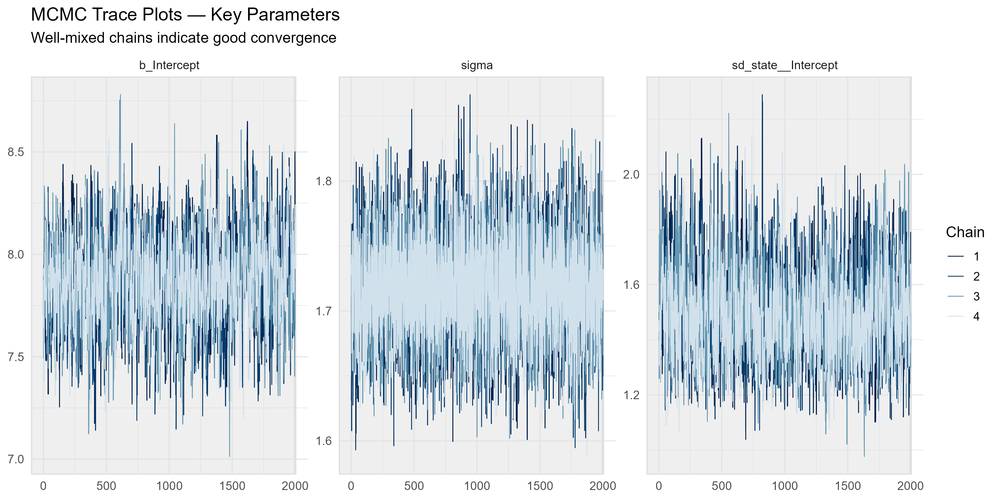
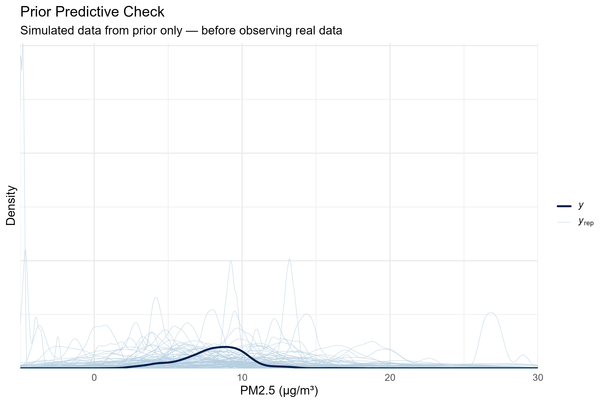
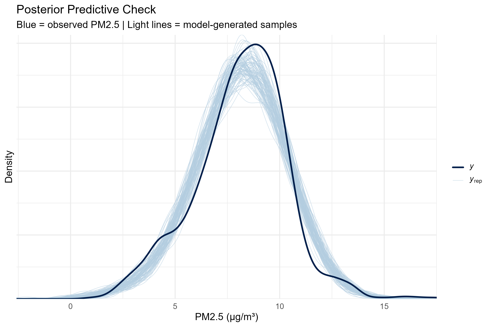
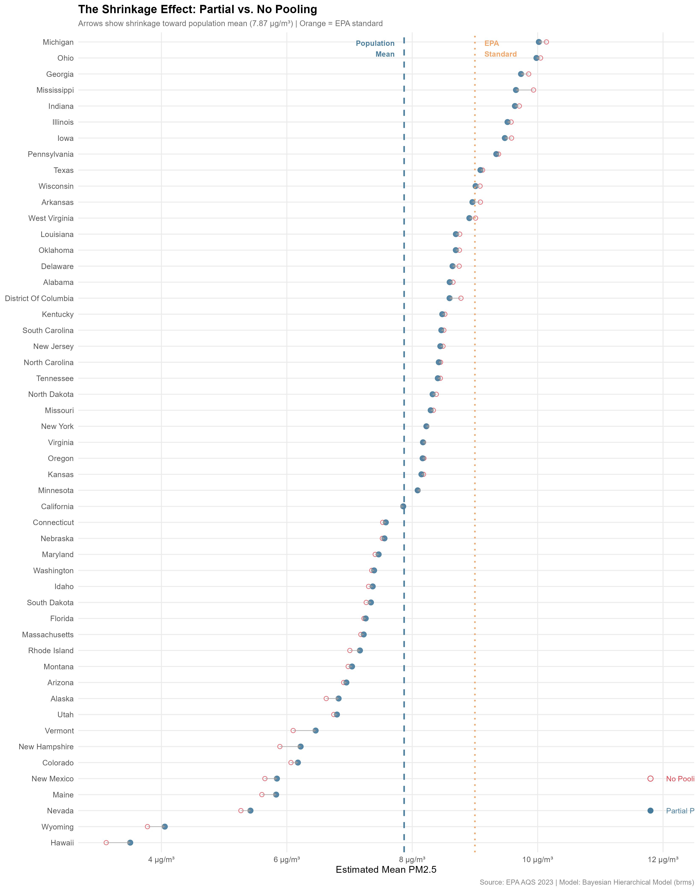
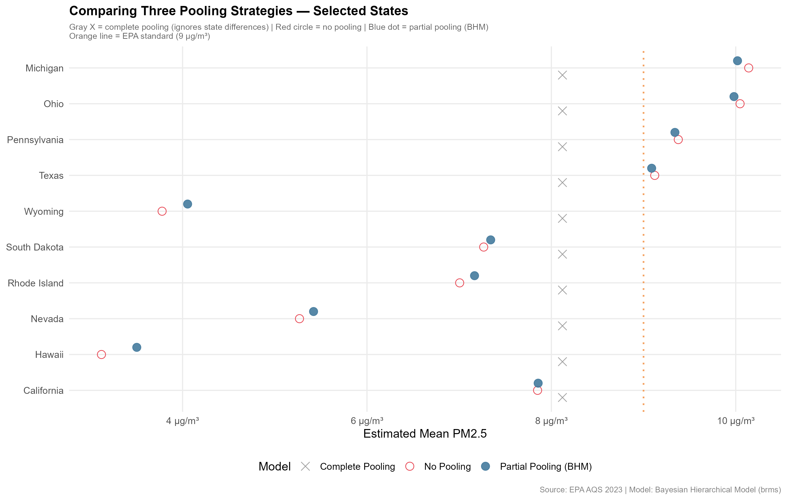
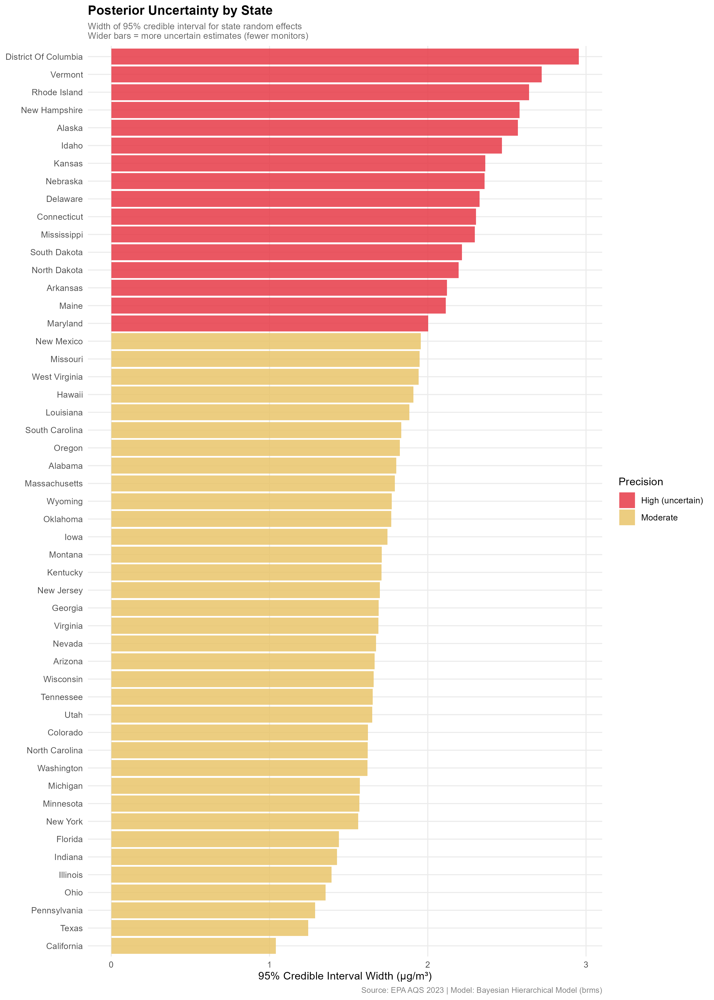
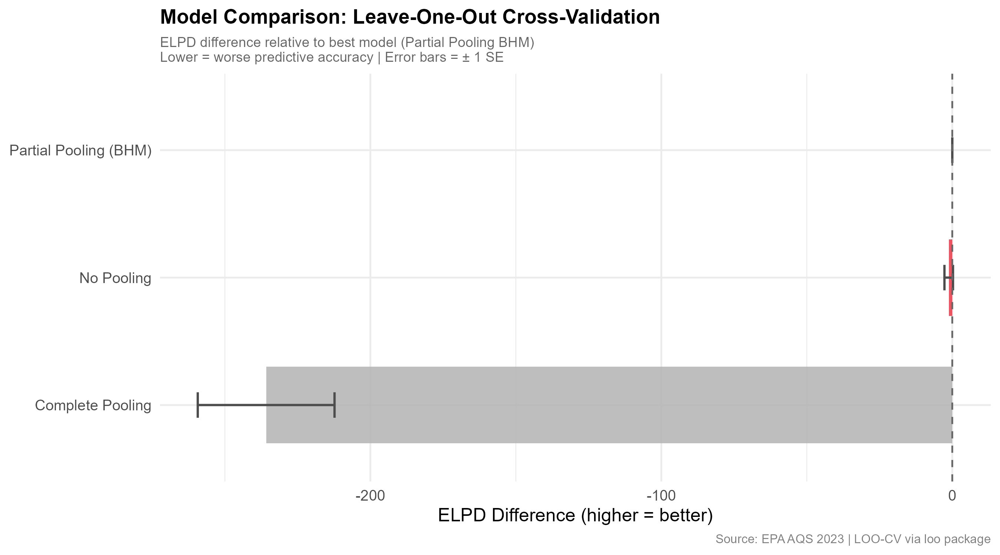

# Bayesian Hierarchical Modeling of U.S. Air Quality

## Applying Partial Pooling to Estimate State-Level PM2.5 Concentrations

[](https://www.r-project.org/)
[](https://paul-buerkner.github.io/brms/)
[](https://aqs.epa.gov/aqsweb/airdata/download_files.html)
[]()
[](LICENSE)

> ⚠️ **Note:** This repository demonstrates the full analytical 
> workflow and methodology. Specific numerical findings are withheld 
> pending manuscript preparation and journal submission. A preprint 
> link will appear here upon arXiv submission. For collaboration or 
> pre-publication access to results, please contact the author.

---

## What Is This Project About?

Every year, the U.S. Environmental Protection Agency (EPA) measures 
air quality at over 1,000 monitoring stations across the country. One 
of the most important pollutants they track is **PM2.5** — tiny 
airborne particles smaller than 2.5 micrometers that can penetrate 
deep into the lungs and bloodstream.

Long-term exposure to PM2.5 is linked to heart disease, lung cancer, 
stroke, and premature death. The EPA has set an annual standard of 
**9 µg/m³** — meaning any area consistently averaging above that 
level poses a long-term public health risk.

But here is the statistical challenge: **some states have hundreds of 
monitoring stations, while others have fewer than ten.** How do we 
fairly compare states when the amount of data available from each one 
is so different? A simple average treats Michigan — with over 700 
monitoring observations — the same as Rhode Island, which has fewer 
than 80. That is not statistically sound.

This project uses **Bayesian Hierarchical Modeling (BHM)** to solve 
that problem — producing state-level PM2.5 estimates that honestly 
reflect both the available data and the uncertainty that comes with 
unequal monitoring coverage.

---

## The Core Idea — Why Hierarchical Modeling?

Imagine you want to know the average test score of students in every 
school in the country. Some schools have 2,000 students (lots of 
data), while others have 15 (very little). You have three options:

| Strategy | What It Does | The Problem |
|----------|-------------|-------------|
| **Complete Pooling** | Treat every student as belonging to one giant national school | Ignores real differences between schools entirely |
| **No Pooling** | Analyze each school completely independently | Tiny schools give wildly unreliable, noisy estimates |
| **Partial Pooling (BHM)** | Let schools share information with each other through a common population model | ✅ Balances local data with shared knowledge |

A Bayesian Hierarchical Model uses **partial pooling**. It lets states 
learn from each other through a shared prior distribution. A state 
with very few monitors borrows statistical strength from similar 
states. A state with hundreds of monitors relies mostly on its own 
data. The model automatically determines the right balance — a process 
called **shrinkage**.

This is not just a technical convenience. It is statistically 
principled. Shrinkage prevents overfitting to noisy data from 
data-sparse states while still capturing genuine regional differences 
in air quality.

---

## Research Questions

1. Do PM2.5 concentrations vary **systematically** across U.S. states, 
   or is the observed variation simply random noise within a uniform 
   national distribution?

2. Does a Bayesian Hierarchical Model provide **better-calibrated 
   estimates** of state-level PM2.5 than complete pooling or no 
   pooling, as evaluated by leave-one-out cross-validation?

3. Which U.S. states have PM2.5 concentrations that are **credibly 
   above or below** the national average after full uncertainty 
   quantification?

4. How does **monitoring coverage** (number of EPA stations per state) 
   affect the precision of air quality estimates, and how does partial 
   pooling compensate for data-sparse states?

---

## Data

**Source:** U.S. Environmental Protection Agency —
[Air Quality System (AQS) Annual Summary 2023](https://aqs.epa.gov/aqsweb/airdata/download_files.html)

| Feature | Details |
|---------|---------|
| Pollutant | PM2.5 — Local Conditions |
| Year | 2023 |
| Raw rows | 82,378 |
| After PM2.5 filter | 26,341 observations |
| After site aggregation | 1,007 unique monitoring sites |
| States covered | 51 (50 states + Washington D.C.) |
| Counties covered | 520 |
| EPA annual standard | 9.0 µg/m³ |

**Data preparation:** Multiple EPA reporting standards produce 
duplicate rows per monitoring site. We aggregated to one annual mean 
per site before modeling, yielding a clean dataset of 1,007 
monitoring sites nested within 520 counties nested within 51 states 
— a natural three-level hierarchical structure.

The raw data file is not included in this repository due to size 
(~15MB). Download instructions are provided in the reproduction 
section below.

---

## Methods

### Statistical Model

We fit three competing models and compared their predictive accuracy 
using leave-one-out cross-validation (LOO-CV):

---

**Model 1 — Complete Pooling (Baseline)**

Assumes all monitoring sites across the country are exchangeable. 
Estimates a single national mean PM2.5 with no state-level 
differentiation.

```
y_i  ~  Normal(μ, σ²)
μ    ~  Normal(8, 5)        [weakly informative prior]
σ    ~  Exponential(1)
```

*Limitation:* Treats Michigan and Hawaii as if they should have 
identical air quality. Systematically underestimates between-state 
variation.

---

**Model 2 — No Pooling**

Estimates a completely independent mean for each state. Captures 
state differences but ignores shared information — producing 
unreliable estimates for states with few monitors.

```
y_ij  ~  Normal(μⱼ, σ²)
μⱼ    ~  Normal(8, 5)       [independent prior per state]
σ     ~  Exponential(1)
```

*Limitation:* Rhode Island (78 observations) gets the same 
statistical weight as California (1,743 observations), leading 
to poorly constrained estimates for data-sparse states.

---

**Model 3 — Partial Pooling / Bayesian Hierarchical Model ⭐**

The primary model. State-level means share a common population 
distribution — they are related but not identical. The degree of 
pooling is learned from the data itself through the hyperparameter τ.

```
y_ij   ~  Normal(μⱼ, σ²)          [observation model]

μⱼ     =  α + uⱼ                  [state mean = global + deviation]

uⱼ     ~  Normal(0, τ²)           [state random effect]

α      ~  Normal(8, 5)            [population mean prior]
τ      ~  HalfCauchy(0, 2.5)      [hyperprior on between-state SD]
σ      ~  Exponential(1)          [within-state noise prior]
```

Where:
- `α` is the national population mean
- `uⱼ` is how much state `j` deviates from that mean
- `τ` controls how much states vary from each other (learned from data)
- `σ` captures within-state monitor-to-monitor variation

**Prior justification:** Priors are weakly informative — centered on 
plausible PM2.5 values but diffuse enough to let data dominate. The 
`HalfCauchy(0, 2.5)` hyperprior on group-level standard deviations 
follows Gelman (2006) as a standard recommendation for hierarchical 
variance parameters.

---

### MCMC Sampling

All models were fit using **Hamiltonian Monte Carlo via the No-U-Turn 
Sampler (NUTS)** implemented in Stan through the `brms` R package.

| Setting | Value |
|---------|-------|
| Chains | 4 |
| Iterations (BHM) | 4,000 (2,000 warmup) |
| Post-warmup draws | 8,000 |
| adapt_delta | 0.95 |
| max_treedepth | 12 |
| Random seed | 42 |

### Model Comparison

Models were compared using **Expected Log Predictive Density (ELPD)** 
via Leave-One-Out Cross-Validation (LOO-CV), implemented with the 
`loo` package. ELPD measures how well each model predicts new 
out-of-sample observations — the gold standard for Bayesian model 
comparison.

---

## Workflow Overview

The analysis is organized into three self-contained scripts that run 
in sequence:

```
Script 01: Data Loading & EDA
    ↓
    Load EPA AQS raw data (82,378 rows)
    Filter to PM2.5 - Local Conditions
    Remove non-US entries
    Aggregate to site level (1,007 sites)
    Exploratory visualizations
    ↓
Script 02: Model Fitting & Diagnostics  
    ↓
    Fit complete pooling model
    Fit no pooling model
    Fit Bayesian Hierarchical Model (BHM)
    MCMC convergence diagnostics
    Prior & posterior predictive checks
    LOO-CV model comparison
    Extract state random effects
    ↓
Script 03: Visualizations
    ↓
    Shrinkage plot
    Forest plot with credible intervals
    Choropleth map
    Pooling comparison
    Uncertainty by state
    LOO comparison chart
```

---

## Diagnostic Results

All diagnostics confirm the BHM converged successfully and produces 
well-calibrated predictions.

| Diagnostic | Result | Threshold | Status |
|-----------|--------|-----------|--------|
| Maximum R-hat | 1.0054 | < 1.01 | ✅ Converged |
| Minimum Neff ratio | 0.1337 | > 0.10 | ✅ Sufficient |
| Divergent transitions | 0 | = 0 | ✅ None |
| Posterior predictive fit | Good | Visual check | ✅ Pass |

**R-hat** measures whether the four MCMC chains converged to the same 
distribution. Values below 1.01 indicate successful convergence. All 
parameters in the BHM passed this criterion.

**Neff ratio** (effective sample size ratio) measures how many 
independent draws the correlated MCMC samples are equivalent to. 
Values above 0.10 are considered acceptable.

### Trace Plots

The trace plots below show four well-mixed chains for all three key 
parameters — the "hairy caterpillar" pattern that indicates the MCMC 
sampler thoroughly explored the posterior distribution without getting 
stuck.



### Prior Predictive Check

Before fitting the model, we simulated data from the prior alone to 
verify that our priors generate plausible PM2.5 values — not negative 
concentrations or physically impossible values above 1,000 µg/m³.



The wide spread of prior predictions (light lines) confirms the priors 
are weakly informative — they allow a broad range of values while 
remaining centered on plausible PM2.5 concentrations. This is 
intentional: we want the data to drive the estimates, not the priors.

### Posterior Predictive Check

After fitting the model, we verify it can reproduce the observed data 
distribution.



The model-generated distributions (light blue) closely envelope the 
observed PM2.5 distribution (dark blue), confirming the Gaussian 
likelihood is appropriate for this data.

---

## Methodological Illustrations

The following visualizations demonstrate the analytical approach. 
Specific numerical findings are reported in the accompanying 
manuscript.

### The Shrinkage Effect

The shrinkage plot illustrates the core mechanism of partial pooling. 
Each arrow connects a state's no-pooling estimate (hollow red circle) 
to its BHM estimate (solid blue circle). States with fewer monitors 
show larger arrows — their estimates are pulled more strongly toward 
the population mean because limited local data means the model 
borrows more from other states.



### Comparing Three Pooling Strategies

This plot demonstrates how the three modeling approaches produce 
different estimates for the same states — particularly for data-sparse 
states where the choice of pooling strategy matters most.



### Posterior Uncertainty by State

Not all state estimates are equally precise. This plot shows the width 
of the 95% credible interval for each state — a direct measure of 
estimation uncertainty. States with fewer monitoring stations have 
wider intervals, reflecting the additional uncertainty that comes 
with limited data.



### Model Comparison

Leave-one-out cross-validation confirms the BHM provides superior 
predictive accuracy compared to complete pooling. Specific ELPD 
values are reported in the manuscript.



---

## Results

> 📄 **Full results are withheld pending manuscript submission.**
> A preprint will be linked here upon arXiv submission.
>
> The analysis identifies statistically credible regional patterns 
> in U.S. PM2.5 concentrations after accounting for monitoring 
> density, hierarchical data structure, and full posterior 
> uncertainty. State-level random effect estimates, credible 
> intervals, and model comparison statistics will be reported 
> in the accompanying manuscript.
>
> For collaboration or pre-publication access to findings, 
> please contact the author directly.

---

## Project Structure

```
Air_Quality/
│
├── data/
│   ├── pm25_clean_2023.csv          ← Cleaned PM2.5 data (site level)
│   └── state_summary_2023.csv       ← State-level descriptive summary
│
├── R/
│   ├── 01_data_loading_eda.R        ← Data cleaning & exploration
│   ├── 02_model_fitting.R           ← Model fitting & diagnostics
│   └── 03_visualizations.R          ← Result visualizations
│
├── outputs/
│   ├── 01_pm25_distribution.png
│   ├── 02_state_means.png
│   ├── 03_within_state_boxplot.png
│   ├── 04_monitor_coverage.png
│   ├── 05_trace_plots.png
│   ├── 06_rhat_plot.png
│   ├── 07_prior_predictive.png
│   ├── 08_posterior_predictive.png
│   ├── 09_shrinkage_plot.png
│   ├── 10_forest_plot.png           ← [Results withheld]
│   ├── 11_choropleth_map.png        ← [Results withheld]
│   ├── 12_pooling_comparison.png
│   ├── 13_uncertainty_by_state.png
│   └── 14_loo_comparison.png
│
└── README.md
```

> **Note on withheld outputs:** The forest plot (10) and choropleth 
> map (11) contain specific numerical findings and are excluded from 
> this public repository pending manuscript submission.

---

## How to Reproduce This Analysis

**System requirements:**
- R version 4.4 or higher
- Rtools 4.5 (Windows) or Xcode Command Line Tools (Mac)
- Approximately 10 minutes runtime on first execution (models are 
  saved after first run and load instantly thereafter)

**Step 1 — Install required packages**

```r
install.packages(c(
  "tidyverse", "janitor", "skimr",
  "brms", "tidybayes", "bayesplot", "loo",
  "ggplot2", "patchwork", "scales",
  "maps", "sf", "viridis"
))
```

**Step 2 — Download the EPA AQS data**

```
URL: https://aqs.epa.gov/aqsweb/airdata/annual_conc_by_monitor_2023.zip
Action: Unzip and place CSV in the data/ folder
```

**Step 3 — Run scripts in order**

```r
source("R/01_data_loading_eda.R")
source("R/02_model_fitting.R")
source("R/03_visualizations.R")
```

All outputs save automatically to the `outputs/` folder. Models are 
cached after the first run — re-running Script 02 loads saved models 
instantly without refitting.

---

## Limitations and Future Directions

**Current scope:**

This analysis models state as the primary grouping unit. In practice, 
air pollution does not respect political boundaries — industrial 
emissions in one state measurably affect air quality in neighboring 
states. The current model does not explicitly account for this 
geographic spillover.

The 2023 cross-sectional design captures one year only. PM2.5 
concentrations fluctuate substantially with wildfire activity, which 
varies dramatically year to year — particularly in western states.

Monitor placement is not random. EPA stations are deliberately sited 
in areas of known concern, which means rural and remote areas may be 
systematically underrepresented in the data.

**Planned extensions:**

- **Spatio-temporal BHM:** Extending to multiple years (2015–2023) to 
  model long-term PM2.5 trends with both spatial and temporal random 
  effects — directly connecting to ongoing wildfire research
- **Spatial random effects:** Adding an ICAR (Intrinsic Conditional 
  AutoRegressive) prior to explicitly model geographic spillover 
  between neighboring states
- **Predictor covariates:** Incorporating population density, 
  industrial output indices, and annual wildfire burned area as 
  fixed-effect predictors to explain state-level variation
- **County-level model:** Fitting the full three-level hierarchy 
  (monitor → county → state) to capture finer-grained geographic 
  patterns

---

## Author

**Princess Tagoe**  
Research interests: Spatio-temporal statistics, Bayesian hierarchical 
methods, environmental risk modeling, wildfire analytics

---

## Citation

If you use this code or methodology in your own work, please cite:

```
Tagoe, P. (2026). Bayesian Hierarchical Modeling of U.S. PM2.5 
Air Quality: A Partial Pooling Approach to State-Level Estimation. 
Manuscript in preparation.
```

*This citation will be updated with journal and DOI information 
upon publication.*

---

## References

- Bürkner, P. C. (2017). brms: An R package for Bayesian multilevel 
  models using Stan. *Journal of Statistical Software*, 80(1), 1–28.
  https://doi.org/10.18637/jss.v080.i01

- Gelman, A. (2006). Prior distributions for variance parameters in 
  hierarchical models. *Bayesian Analysis*, 1(3), 515–534.

- Gelman, A., & Hill, J. (2007). *Data analysis using regression and 
  multilevel/hierarchical models*. Cambridge University Press.

- U.S. Environmental Protection Agency. (2023). Air Quality System 
  (AQS) Annual Summary Data. 
  https://aqs.epa.gov/aqsweb/airdata/download_files.html

- Vehtari, A., Gelman, A., & Gabry, J. (2017). Practical Bayesian 
  model evaluation using leave-one-out cross-validation and WAIC. 
  *Statistics and Computing*, 27(5), 1413–1432.
  https://doi.org/10.1007/s11222-016-9696-4

---

## License

This repository is licensed under the **MIT License** — you are free 
to use and adapt the code with attribution.

The EPA AQS data used in this analysis is in the public domain. 
Specific analytical findings (state-level estimates, model comparison 
statistics) are the intellectual contribution of the author and are 
withheld pending publication.
